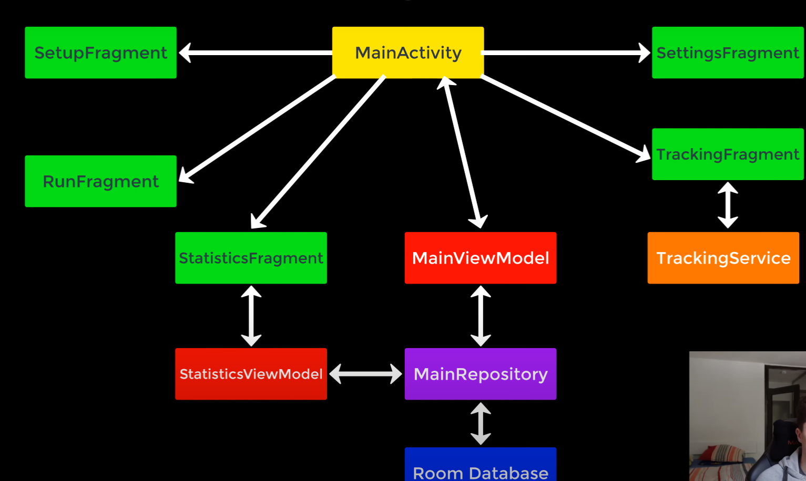
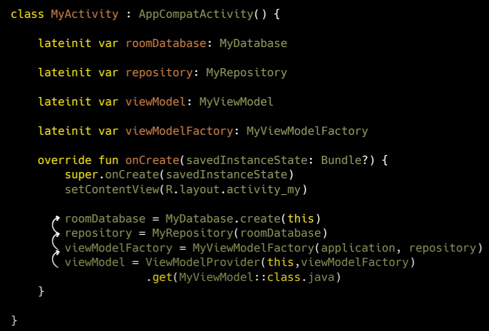
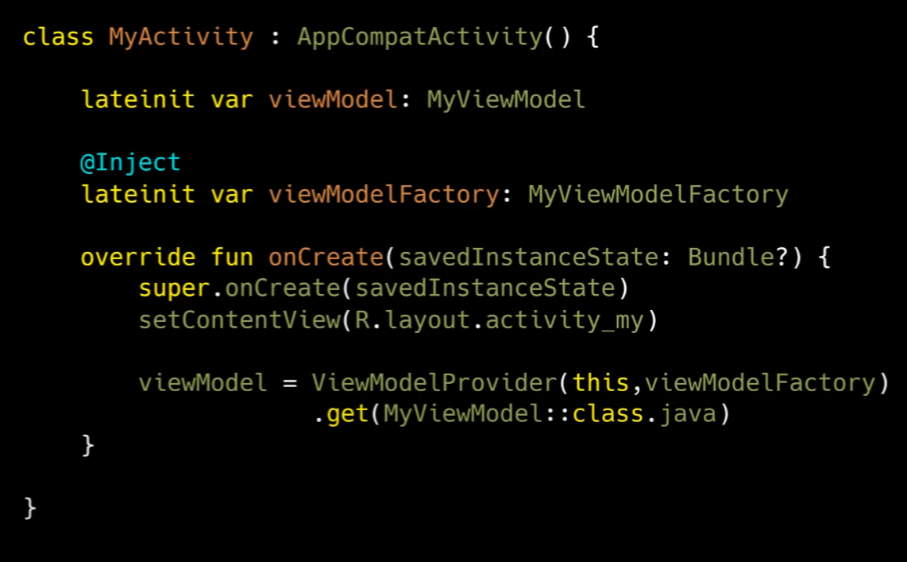
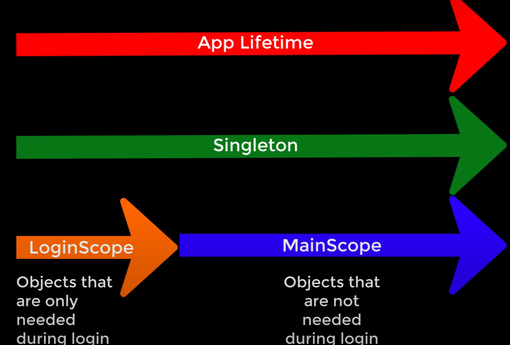

# Run Tracker

This is the basic [tutorial](https://www.youtube.com/watch?v=XqkFTG10sRk&list=PLQkwcJG4YTCQ6emtoqSZS2FVwZR9FT3BV&index=2&ab_channel=PhilippLackner) I followed.
I changed the UI to a more modern one using Jetpack Compose, updated the dependencies and also added some features.

# Project Overview and Architecture

MVVM Architecture, Navigation components, Room database with Coroutines and Dependency Injection with Dagger.

Architecture Overview: we will only use a single Activity with 5 fragments (single activity development).

TrackingService if for tracking the run with the app not displayed, it will be a foreground service.

MainViewModel: the view model of the Main Activity.

StatisticsViewModel: for separating the statistics state, because this data will only be used in this screen.



# Project prerequisites

Migration from extensions to jetpack view binding: [See documentation](https://developer.android.com/topic/libraries/view-binding/migration).

Migration from kapt to ksp: [See documentation](https://developer.android.com/build/migrate-to-ksp).

Add safe args dependency: [See documentation](https://developer.android.com/guide/navigation/use-graph/safe-args).

Added permissions in AndroidManifest.xml and also changed MainActivity launch mode to singleTask which means that only a single task of the activity will exist at a time.

Also added metadata needed Google Maps. Get your own API key from [Google Cloud Console](https://developers.google.com/maps/documentation/android-sdk/get-api-key).

Get SHA-1 app fingerprint: [See tutorial](https://stackoverflow.com/questions/27609442/how-to-get-the-sha-1-fingerprint-certificate-in-android-studio-for-debug-mode).

Maps SDK for android quickstart: [See tutorial](https://developers.google.com/maps/documentation/android-sdk/start).

# Run Entity & Run Dao

The Run Entity will be the data class that will represent the run in the database.

The Run Dao will be the interface that will define the operations that we can do with the database.

The best practice with data types in timestamps is to use the same data type for all timestamps and then have functions that convert them to the needed format.

# Running Database & TypeConverter

We need a type converter to convert the img Bitmap to a type that can be stored in Room and vice versa.

By using the @TypeConverter annotation, Room will know that this function should be used to convert the data.

In the RunningDatabase we need to specify, using annotations, the entities that we want to store in the database and the type converters that we want to use.
Since we are using Dagger for dependency injection, we don't need to ensure that the database is a singleton.

# What is Dagger

Dagger is a dependency injection framework that is used to reduce the boilerplate code that is needed to provide dependencies to classes.
A dependency is a kotlin object or variable. If objectA relies on objectB then objectB is a dependency of objectA.

```kotlin
data class Person(
    val name: String,
    val age: Int,
    val hometown: String
)
```
The Person class has three dependencies: name, age, and hometown.

```kotlin
val name = "Pablo"
val age = 24
val hometown = "O Pino"
val person = Person(name, age, hometown)
```
When we create an instance of the Person class, we need to provide the dependencies.

This can quickly become a problem when we have a lot of dependencies or when we have dependencies that are used in multiple classes.
For example the following code has dependencies that also need other dependencies:


The solution to this problem is to use a dependency injection framework like Dagger.
By using the @Inject annotation, Dagger will know that this class needs to be provided by Dagger. 
This way instead of having the code that provides the dependencies in the class that needs them, we can have a separate class that provides the dependencies.



Dagger also lets control the scope of the dependencies (the lifetime). For example, we can have a singleton dependency that is only created once and then reused in all the classes that need it.



This feature won't be used in this project since it is a small app that won't benefit from scoping in terms of performance improvement.

# Dagger-Hilt Setup

[Dagger-Hilt](https://developer.android.com/training/dependency-injection/hilt-android?hl=es-419) is a library that reduces the boilerplate code that is needed to use Dagger for dependency injection.

The dependency `implementation(libs.androidx.hilt.lifecycle.viewmodel)` is no longer need, check [here](https://dagger.dev/hilt/view-model.html) on how to use Dagger-Hilt with ViewModels.

After adding the dependencies we have to tell our app to use Dagger-Hilt as the dependency injection library. For that we have to create a new Application class and add it to the AndroidManifest.xml.

Dagger needs to know how to create a RunningDatabase to then inject it. That is specified in the modules. The annotation @ApplicationContext is used to tell Dagger that the context is needed to create the RunningDatabase (it inserts the application context).

By creating the function provideRunningDatabase we are telling Dagger that when a RunningDatabase is needed, it should use this function to create it.

To inject a variable into an activity we have to annotate the activity with @AndroidEntryPoint and then use the @Inject annotation to tell Dagger that this variable should be injected.

# Architectural Skeleton

The architecture skeleton of an app is the basic structure of the project. We will have the foundation to build on later.

To setup Timber we only have to add the dependency and then call Timber.plant(Timber.DebugTree()) in the onCreate of the Application class.

In an MVVM architecture the job of the repository is to collect the data from the different data sources (in this case the Room database) and then provide it to the view model.

The job of the MainViewModel is to get the data from the repository and then provide it to the view (in this case the fragments of the app).

To inject the view model into the fragment we have to create a val to inject the view model and add the @AndroidEntryPoint annotation to the fragment.

# Setting up Navigation

In the nav_graph.xml we have to add the fragments that we want to navigate to. We also have to add the actions that will be used to navigate between the fragments.

Check [here](https://developer.android.com/guide/navigation#add-navhost) how to add navigation. And [here](https://developer.android.com/develop/ui/compose/navigation) to know more about navigation with Jetpack Compose.

This [todo app](https://github.com/android/architecture-samples/tree/main) is an example of an app built with Jetpack Compose using a single-activity architecture with Navigation Compose.

RunTrackerNavGraph.kt contains the structure of the navigation system and RunTrackerNavigation.kt define the actions that can be performed to facilitate navigation between screens.

[Here](https://medium.com/@bharadwaj.rns/bottom-navigation-in-jetpack-compose-using-material3-c153ccbf0593) is a step by step on how to build a bottom navigation in Jetpack Compose.

# Handling Location Permissions

EasyPermissions is a library that simplifies the process of requesting permissions in Android.

If the user permanently denies the permission, we have to show a dialog that explains why the permission is needed and then send the user to the settings to enable the permission.

# Handling the Map's Lifecycle

Each map has its own lifecycle. We have to make sure that the map is correctly initialized and destroyed when the fragment is created and destroyed.

Add a map to your Android app (Kotlin with Compose) following this [tutorial](https://developers.google.com/codelabs/maps-platform/maps-platform-101-compose#0)

# Tracking Service Basic Setup

The TrackingService will be a foreground service that will track the user's location.

For the activity-service communication and fragment-service communication we are going to use intents. 
Whenever we want to send a command to our service we will simply send an intent to the service with the action and in the service receive the action and act accordingly.

We also have to worry about the communication from the service to the tracking fragment. For that we will use a singleton pattern. Put the properties in a companion object inside the service and then access them from the fragment.

# Making our service a foreground service

A foreground service must come with a notification. The notification is used to tell the user that the service is running and to give the user the option to stop the service.
This way the android system knows that the service is important to the user and won't kill it.

The code of this chapter creates a notification that is shown when the service is started and by clicking on the notification the user is taken to the tracking screen.

# Tracking User Location in the Background

pathPoints is MutableLiveData<MutableList<MutableList<LatLng>>>() because it needs to be a list of lists in case a user stops and starts the tracking again (if the user does that
the two tracks shouldn't be connected, that's why it is a list of lists).

# Drawing the Running Track on the Map

The Map of the RunningScreen is subscribed to the changes in location written in the TrackingService.

With the current code it doesn't permit to stop and resume a run because there is only a list of LatLng, not a list of lists of LatLng.

# Implementing the Stop Watch

There is a calculation for time in millis and in time without millis. The timer is managed in the TrackingService and observed in the TrackingScreen.

# Updating the Notification

We will be using dependency injection in the notification. The notification will be updated with the time and the distance of the run.

To update a notification we have to put a new notification with the same id.

# Canceling a Run

When the user cancels a run we have to stop the service, delete the notification and don't save the run.

# Save a Run in the Database

When clicking the "finish run" button we have to stop the service, save the run in the database and navigate to the run screen.

# Showing Runs in the RunScreen

The RunScreen will show all the runs that are saved in the database.

# Sorting runs

We will use a mediator LiveData so we can merge the LiveDatas of each sort type and then observe the merged live data in the screen.